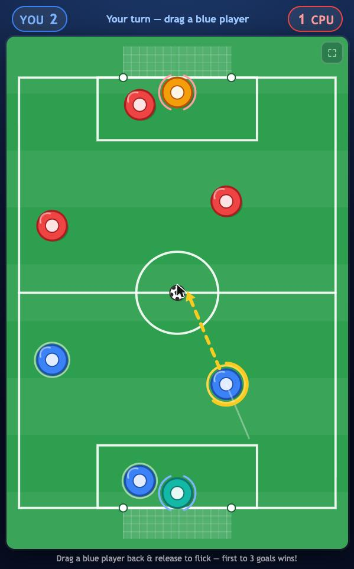
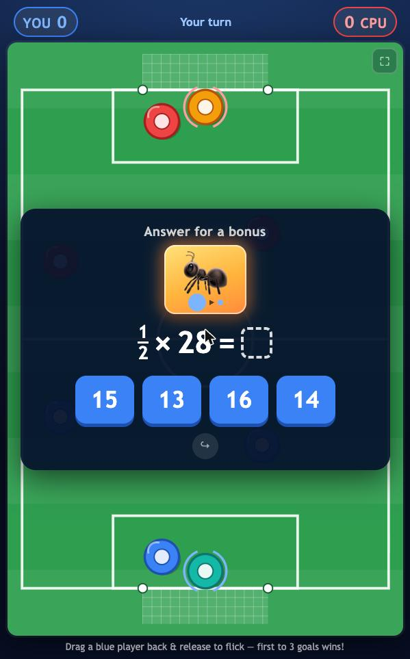
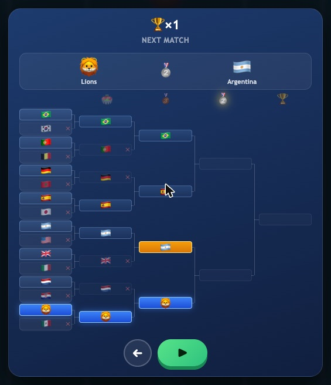
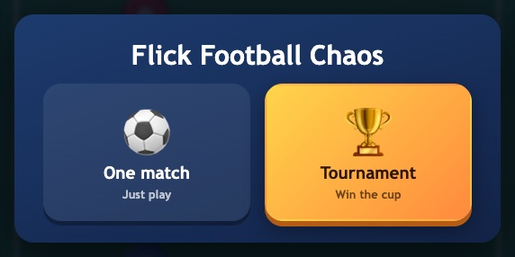
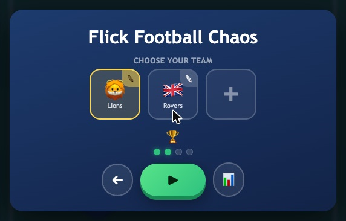
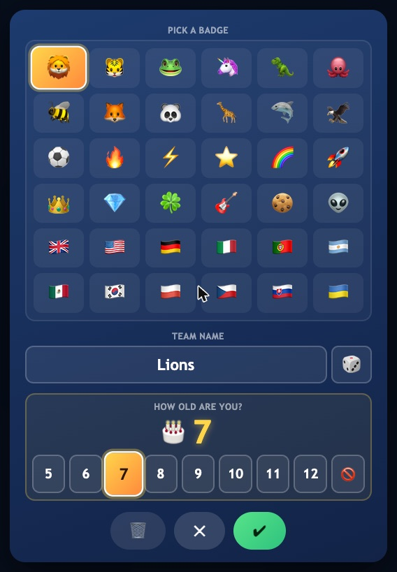
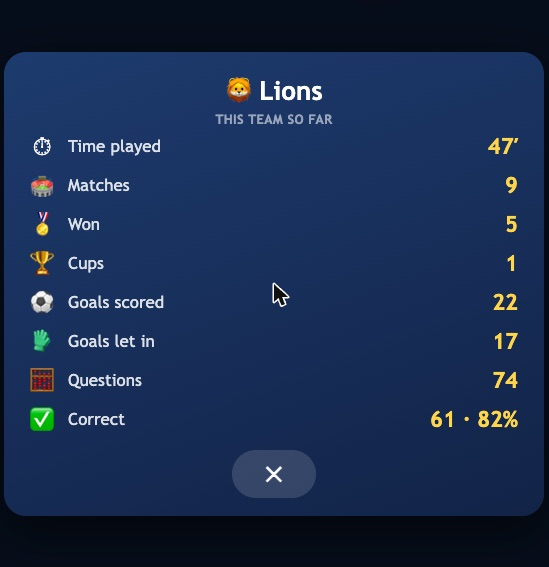
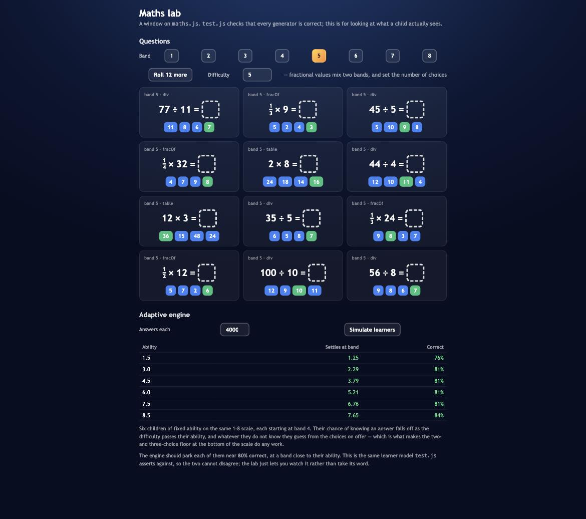

# ⚽ Flick Football Chaos

A turn-based flick-football game that teaches maths from age 5 to 16+ by
making the maths worth doing.

**[▶ Play it](https://mrshu.github.io/flick-football-chaos/)** — no install, no
account, works on a phone.

<p align="center">
  
  
</p>

---

## The idea

Most educational games are a quiz with a game bolted on: answer ten questions,
then you may play. A child learns very quickly that the game is the reward and
the maths is the toll.

Here the maths *is* a move. Before some turns you are offered a question, and
getting it right hands you something you actually wanted a second ago — a
charged shot, or a goalkeeper who dives the right way. You can always skip it.
The pitch does not wait for you to be good at arithmetic; it just plays better
when you are.

Two rules follow from that, and most of the design falls out of them:

- **A wrong answer never costs a turn.** It costs the bonus, nothing else.
  Being wrong has to be survivable or a child stops guessing, and a child who
  stops guessing stops learning.
- **Questions are occasional.** Roughly one turn in three, and only when you
  are in the attacking half with something to gain. Asked every turn, they stop
  being an opportunity and become a toll again.

---

## Playing

**Drag a blue player back and release** — like a catapult. Further back is
harder. First to three goals wins.


- Your **goalkeeper** (teal) is a player like any other. You can flick it
  upfield as a clearance — at the real cost of leaving your goal empty.
- The **opposing keeper** holds still while you aim, then dives once you have
  flicked, at where it reads the ball going. It reads imperfectly, and how
  imperfectly is what separates a first-round opponent from a final.
- Beating it is about **placement**. Against the toughest keeper the middle of
  the goal scores 0% of the time and the corners 42–50%.
- Occasionally **chaos** strikes — the ball goes slippery, or shots get extra
  power. It is announced, it lasts a turn or two, and it applies to both sides.

<br clear="right">

---

## The maths


Questions are drawn from **eleven bands**, ages 5 to 16+:

| Band | Roughly | What it asks |
|-----:|:--------|:-------------|
| 1 | 5 | counting to 5, number bonds to 5 |
| 2 | 6 | adding and subtracting within 10 and 20 |
| 3 | 7 | within 20, doubles, sequences |
| 4 | 8 | multiplication, within 100, halves |
| 5 | 9 | times tables, division, fractions of a number |
| 6 | 10 | within 1000, decimals, comparing fractions |
| 7 | 11 | percentages, order of operations, ratio |
| 8 | 12 | negatives, squares, roots, simple equations |
| 9 | 13 | two-step equations, expanding, angles, sequences |
| 10 | 14–15 | simultaneous equations, Pythagoras, quadratic sequences |
| 11 | 16+ | index laws, inequalities, geometric sequences, areas |

You pick a starting band once, when you make a team. After that the game moves
you.

<br clear="right">

### How it adapts

The difficulty is a continuous number, not a level. Every answer nudges it:

- **Right, and quick** → up a lot. A child who is fast *and* correct is bored,
  and the fix for bored is not more of the same.
- **Right, but slow** → up a little.
- **Wrong** → down four times as far as a single right answer moves you up.

Those steps are chosen so the random walk settles where you are **right about
80% of the time** — high enough to feel good, low enough to be learning. A
child who is suddenly flying can climb more than a whole year's band in a few
questions; one who is struggling drops back within a few.

At the very bottom the game runs out of easier questions, so it gives ground a
different way: the number of answer choices falls from four to three to two.
Being right stays possible.

At the top the same lever runs the other way. From band 9 the choices rise
to five, then six at band 11 — not because the numbers need it, but because a
learner who has reached simultaneous equations or index laws deserves a
format where a lucky guess buys less. The 80% the difficulty curve is aiming
for should mean something.

---

## The cup

<p align="center">
  
</p>

A real sixteen-team knockout, drawn in full. You take the seed-2 line; every
other match is settled by seed, which is not a shortcut — it is what makes your
four opponents rise in strength in step with the difficulty curve, with the top
seed waiting in the final. Rounds you have not reached stay undecided, because
in a real knockout they have not been played yet either.

Losing a round replays it. It never eliminates you: a child losing the final
should not lose the tournament.

---

## Teams

<p align="center">
  
  
</p>

Three save slots, so siblings can share a tablet without dragging each other's
difficulty around — the adaptive state is per slot, and an average of two
children describes neither.



Each team gets a badge, a name and an age. The name is filled in for you: pick
a flag and you are that country, pick anything else and you get an invented
name built from syllables. A dice rerolls it, and once you type your own it
stops being overwritten.

The age also sets the starting band and, from 13 up, swaps the bright
playroom look for a restrained "pro" skin — squarer panels, dark broadcast
colours, calmer motion. Nothing moves or resizes; it is the same markup in
darker, straighter clothes, because a 16 year old should not have to play on
a screen built to delight a 6 year old.

Everything lives in `localStorage`, and every read is repaired on the way in —
a corrupt save yields a fresh slot rather than a broken game.

<br clear="right">

<p align="center">
  
</p>

---

## Running it

There is no build step. Clone it and open `index.html`.

```sh
git clone https://github.com/mrshu/flick-football-chaos.git
cd flick-football-chaos
open index.html          # or: python3 -m http.server 8000
```

Run the tests with Node — no framework, no dependencies:

```sh
node test.js             # 32,077 checks, ~0.1s
```

The suite is deliberately small for what it covers. It has been checked by
mutation testing: breaking a constant or flipping a comparison in the maths
engine makes it fail. A test that cannot fail is not a test.

### Maths lab

Open `maths-lab.html` to see what `maths.js` actually produces. The tests prove
the generators are correct; this is for judging whether the questions are any
good — which is not something an assertion can tell you.

<p align="center">
  
</p>

It renders questions with the game's own renderer, so a question here looks
exactly like a question in a match, and it runs the adaptive engine against the
same synthetic learner `test.js` asserts against — so the lab and the suite
cannot quietly disagree.

---

## How it is put together

```
index.html      markup for every screen
style.css       all of it
game.js         the game: physics, turns, AI, rendering, screens
maths.js        question generators and the adaptive engine   (pure)
tournament.js   the sixteen-team draw and its resolution      (pure)
formation.js    kickoff layouts, keeper geometry, AI aiming   (pure)
names.js        invented team names and country names         (pure)
store.js        localStorage, per slot, with repair           (pure-ish)
quiz.js         the question panel
test.js         the whole suite
```

The modules marked pure have no DOM, no game state, and no randomness of their
own — the caller passes a random function in. That is what makes them testable
against a fixed seed, and it is why the tests can simulate four thousand
questions and assert where a learner ends up.

A few constraints that shaped the code:

- **No frameworks, no build, no dependencies.** It has to keep working in five
  years with nothing installed.
- **No ES modules.** They cannot load over `file://`, and opening the file has
  to work.
- **No image or audio assets.** Everything is drawn on a canvas, styled in CSS,
  or is an emoji. Nothing to fetch, nothing to break.
- **As little language as possible.** The controls carry icons first and words
  second; the questions themselves are symbols and numbers, so the maths does
  not need reading. The interface text is English for now.
